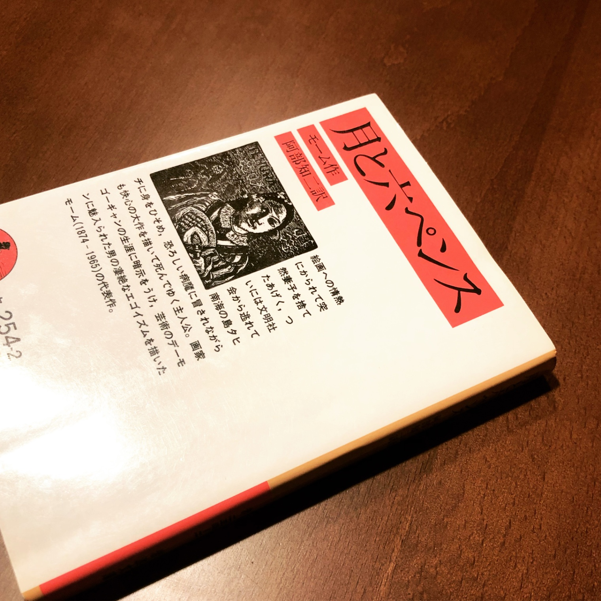

+++
title = "『月と六ペンス』感想"
date = 2023-11-17
aliases = ["/blog/2023-11-17_the-moon-and-sixpence/"]

[extra]
toc = false

[taxonomies]
tags = ["book"]
+++

サマセットモームの『月と六ペンス』を4月に読んで感想を記してあった。
<!-- more -->

## 感想
訳が古いからか最初は読みにくかったけど、ストリクランドが動き出したくらいからはあまり気にならなくなった。

この作品はゴーギャンに着想を得て書かれたものではありつつもそれはあくまで着想であり、実際のところのゴーギャンやモーム自身のエピソードに忠実なわけではないらしい。俺が気に入ってるのはあくまで主人公の視点で物語が進んでいくところ。ストリクランド含めさまざまな登場人物の言動や心情について、主人公の解釈はあっても絶対的な答え合わせがなされることはない。この辺りを神視点で解ったように断定して進む作品は多いしそれは別に悪いことではないのだけど、この作品は一貫して主人公の印象に基づくという形のみに描き、不可解なものを不可解と描写する箇所も多いように思う。人間は思いもよらないことになりうるとか、それを当時の私は認識していなかったといった表現が何度も出てきていて、モームの人間観が感じられるのがなんだか良い。

この作品がゴーギャンの伝記でないとすればストリクランドという芸術家の生き様は少なからずモームが考えたものであって、彼の考える芸術家がここに現れているということでもあるみたい。名誉とか権威的なものに抗うどころかそういったものに囚われずに美を追求しようとする様は天才の感を思わせるし凡人に真似できるものではないように感じるけど、このような姿勢はハッカー的で憧れる。

俺もストリクランドのように、自分に内在する根源的な欲求に従って、あっけなく持ち物を捨てられるだろうか。このように考えてしまうこと自体が、あるいはストリクランドに少なからず憧れるところそれ自身が、おれが俗物であることの証明になっているように思えなくもないね。

とりあえず、俄然ゴーギャンに興味が湧いたので彼の絵を観にいきたいと思った。興味ある人いれば一緒に行きましょう
