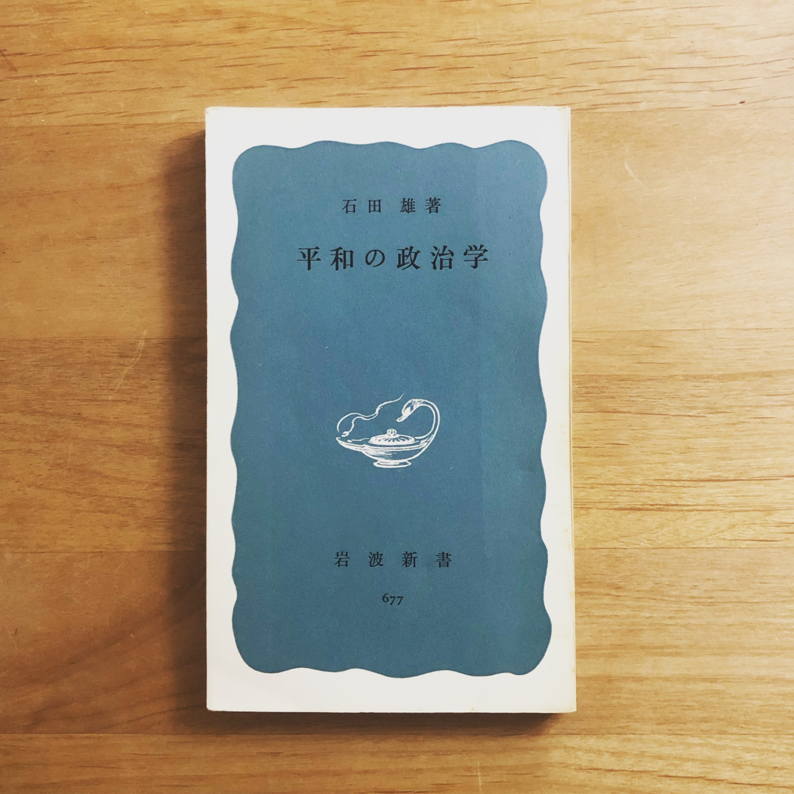

+++
title = "『平和の政治学』感想"
date = 2023-11-20
aliases = ["/blog/2023-11-20_politics-of-peace/"]
description = "石田雄『平和の政治学』を読んだ"

[extra]
toc = false

[taxonomies]
tags = ["book"]
+++

- 『平和の政治学』石田雄
- 感想は2023-05-26に記したもの

## 感想
平和の観点から個々人や民衆に求められる政治的態度と平和的政策について主張を展開する本。めちゃくちゃ古い。

最初のほうは文化間における平和が指すものの違い、西洋史において戦争が平和観からどのように影響を受けてきたかなどが書かれていて、非常に興味深く読んだ。面白かった。

前半では、政治に背をむけることで中立であろうとしたり「潔癖」であろうとする態度と、選挙ばかりに多大な労力を割く「政治主義的態度」のどちらもが、政治を政治家のものとする日本の伝統的政治観に起因するものであると述べたうえで批判している箇所があった。普段の自分は政治的な主張に辟易してそれを避けがちでありながら選挙には行くのでまさに前述の両極的態度を同居させているし、実際にこれらはよりよい民主主義のためには克服すべきものだと思う。そうやって同意して読み進めていたのに後半に入ってより具体的な政策的主張を読んでいたらなんだか疲れてしまって、政治に対する理想的な態度を取ることの困難を感じてしまった。日本国憲法の「不断の努力」とかカントの「理念への不断の接近」というのはつまりこういうことなんだよな、大変だなという気持ちになった。

そういうわけで後半を読むのはかなり疲れたので、途中からは時代を感じる記述を見つけて歴史と照らし合わせて楽しむという読み方をしていた。沖縄返還がどうだとか安保法が何だとか、歴史の教科書で見た出来事が実際の社会問題として登場するのが新鮮で、不思議な感覚になってとても面白かった。
