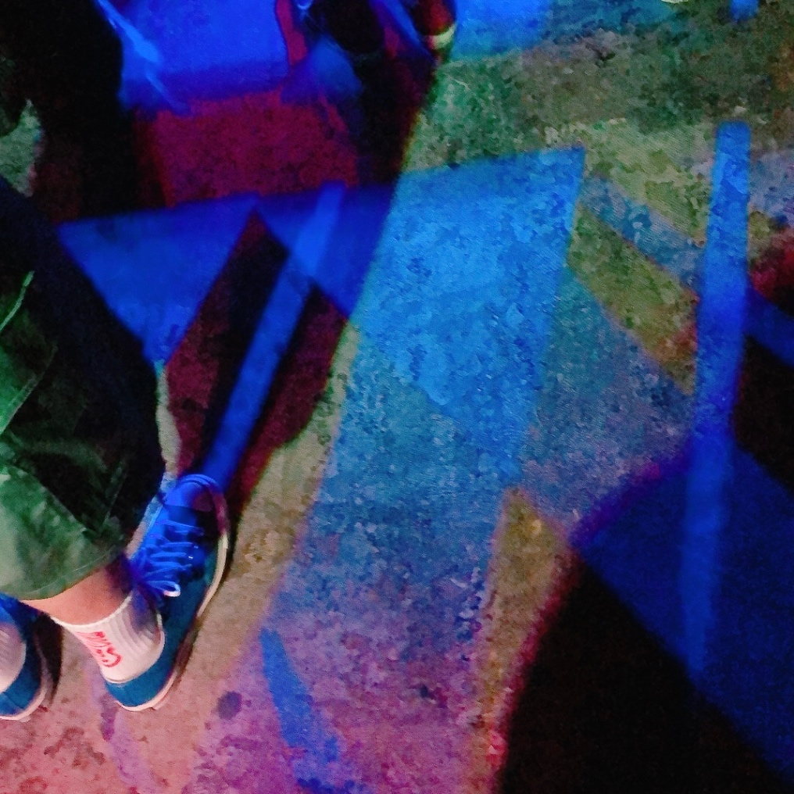

+++
title = "連続"
date = 2024-01-23

[taxonomies]
tags = ["essay"]
+++

今まで憧れるばかりでいたマイルストーンに到達したのだとしても、そこに至ろうとする歩みが現実的あるいは日常的なものであるほど、その過程は階段を登るようにはいかず実際には常に連続的なふるまいであるから、壁に掛かった絵の端の、その立体的な絵具が砂のような額縁もろとも刷り落とされ広がるように、行きたかった場所はかつていた場所と当たり前に地続きであったことが実感されてしまって、その感覚じたいが俺の成長を明らかにするいち要素なのだと言ってみるにしても、自分の中にあった微笑ましくステレオタイプな憧れをかつて思っていたように祝えるわけではないのを寂しく思うことは避けられないのだ

（[2024-01-23](https://sizu.me/lemonadern/posts/exa5fze69mre) より改題のうえ掲載）
