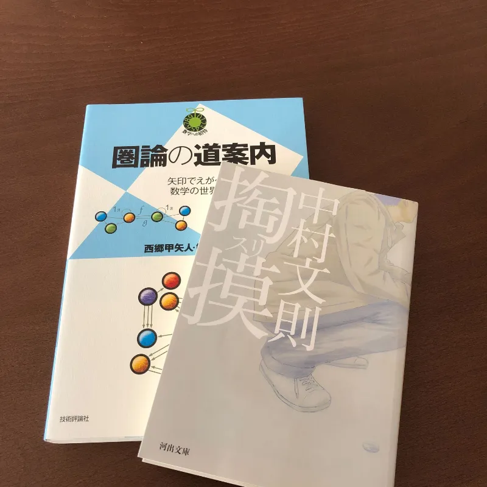

+++
title = "2023-01-05"
description = "OAuth、むじー（山口コンボイ）"
date = 2023-01-05
aliases = ["/nightly/2023/01/05/"]

+++

# やったこと

- OAuth2.0 の勉強
  - rfc6749 を読んだ（途中）
- 本を買った
- lume のコードリーディング
- 日報の改善

## 感想

今日はまあまあ頑張った気がする。一日中勉強しかしてないから貴族にでもなった気分。モラトリアムの横暴。

### OAuth

認可サーバの実装をしなければいけないことを突然思い出したので、途中でやめてしまっていた
rfc6749[^1]
をまた読み始めた。[^2]軽くでも目を通さないと実装しようがないからとりあえずメモを取りながら読んでるんだけど、全然読み終わらない。

でも、いつかの Software Design に載っていた OAuth/OpenID Connect
の特集を読み返したら前よりも解像度高く内容が入ってきたので、成長はしているみたい。よかった。

この仕様のほかにはトークン関連の rfc6750[^3] と PKCE[^4]
を読む必要がありそうなことは分かっている。コツコツがんばります。

### 本

買ったのは中村文則の掏摸と、圏論の本。

今年は Haskell
を真面目に勉強しようと思っているので、圏論の方にもすぐ入門できるようにと入門書を買っておいた。
Haskell
を書くだけなら別に圏論の知識はいらないだろうけど、一見役に立たなそうなほど抽象的な概念の理解が具体的な実装を助けるという経験はこの一年で何度もした。圏論自体にも興味はあるから、好きなときに読もうと思っている。

中村文則は普通にハマってしまった。小説書ける人ってすごい。

### lume

日報をいじっていたらめちゃくちゃにバグを踏んでしまったので lume
のコードを読んでいた。バグの原因は型まわりの不整合だと特定できたし、近いうちにコントリビュートできると思う。今年はOSSにたくさんコントリビュートしたいぜ。

---

# 考えたこと

## Zod

今日はTwitterでZodが話題だった。Zodは便利だけど、その便利さを実現するためにTSの型ではなくZodのスキーマに追従したコードを書くことになる。これがそのまままるごと負債になる可能性ももちろんあるので、なんでもかんでも使うのは普通にやめたほうがいいと思う。ところでその流れで
[ajv-validator/ajv](https://github.com/ajv-validator/ajv)
というのがあることも知った。これはJSON
Schemaファーストなバリデータらしい。今度使ってみる。

---

:t-rex:

[^1]: https://tools.ietf.org/html/rfc6749

[^2]: 日本語で読んでる

[^3]: https://tools.ietf.org/html/rfc6750

[^4]: https://tools.ietf.org/html/rfc7636
