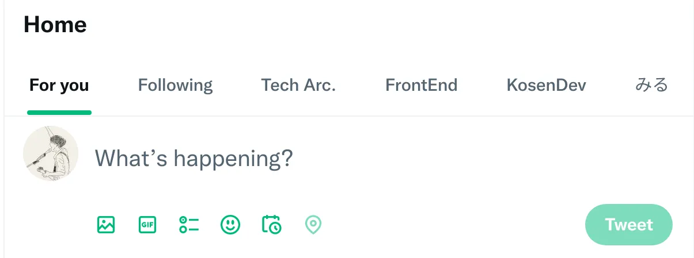

+++
title = "2023-01-14"
description = "器楽的緩怠"
date = 2023-01-14
aliases = ["/nightly/2023/01/14/"]

[taxonomies]
tags = ["nightly"]
+++


# やったこと

- 日報の改善
- 読書

ほぼ何もしていない。

お茶をいれて飲み、コーヒーをいれて飲み、というだけの休日だった。怠惰！！！

## 日報の改善

昨日今日と翌日に日報を書くという状況になっているので、それがしやすくなるような機能を追加した。

もともと日報はPCで書き、書いたらcommit・push・自動デプロイという形で運用している。
日報のテンプレートが生成されるショートカットを deno task
から使えるようにしてあるのだけど、このショートカットは当日分生成の機能しか備えていなかったので、別の日の分も生成できるようにした。

```
> deno task nightly
Task nightly
2023-01-15
```

=> 何も指定しなければ当日分が生成される。

```
> deno task nightly yesterday
Task nightly 
2023-01-14
```

=> yesterday と指定すると前日分が生成される。

これは date コマンドに引数をそのまま渡して日付を生成しているだけなので、date
コマンドがサポートする引数であれば何でも指定できる。

これでちょっと便利になった。

## 読書

梶井基次郎を読んでる。この人は、心理状態や考えから多分に影響される情景を書くのがうまいなと思う。
この人の作品好きだ。

# 思ったこと

## Twitter Web の Tab UI いいね



For you と Following
がタブで分かれ、ネイティブアプリのようにタブでリストが見れるようになった。

Web版でリストを簡単に見れるようになったのがうれしい^[TweetDeckはUIがダサくて好きじゃないので使っていない]。ありがとうイーロン（？）

---

:diving_mask:

---

> その時間私とその友達とは音楽に何の批評をするのでもなく黙り合って煙草を吸うのだったが、何時の間にか私達の間できまりになってしまった各々の孤独ということも、その晩そのときにとっては非常に似つかわしかった。そうして黙って気を鎮めていると私は自分を捕らえている強い感動が一種無感動に似た気持を伴って来ていることを感じた。煙草を出す。口にくわえる。そして静かにそれを吹かすのが、いかにも「何の変ったことのない」感じなのであった。

梶井基次郎『器楽的幻覚』
