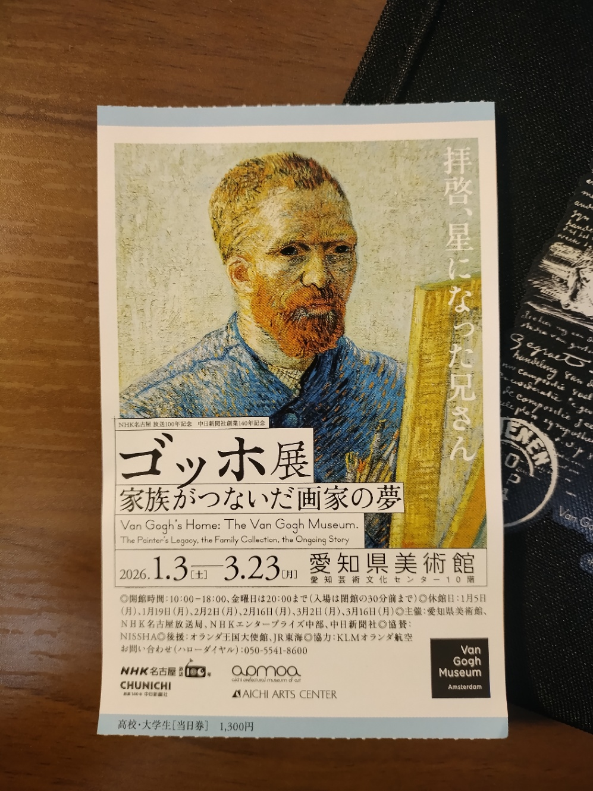

+++
title = "「ゴッホ展　家族がつないだ画家の夢」に行った"
date = 2026-01-10

[taxonomies]
tags = ["art"]

[extra]
lang = "ja"
heading_hashes = true
+++

ゴッホ展に行った。「ゴッホ展　家族がつないだ画家の夢」と題して大阪・東京に続いて名古屋展が愛知県美術館で開催されている。 オランダにある[ファン・ゴッホ美術館](https://www.vangoghmuseum.nl)の所蔵品を中心として80近くの作品が展示されている。

<!-- more -->

周る速さとかは特に考えず鑑賞していたが、入ってから出るまで全部で2時間半くらいだったと思う。最後の方は足が痛かった。当日券は現地で購入した。特に並ばず買えたが、退場時（18時頃）はチケット売り場にそれなりの列が出来て混雑していた。金曜日は20時までやっているので仕事終わりの人たちが来ていたのかな。展示場内部はというと、人が多すぎるというほどではないもののそれなりに賑わっている印象だった。どの作品の前にも1~5人くらいずつ満遍なく人がいる。1,2人待てさえすればじっくり見る時間もチャンスもある、といった感じ。

（ところで、これとは全く別の「大ゴッホ展」という企画が神戸にて時を同じくして開催されているらしい。名古屋の方の混雑状況を知りたくて X を眺めていたが、神戸と名古屋の情報が混ざって出てくるのでとても紛らわしかった。あちらには予約という概念があるらしく、平日にも関わらず大変な混雑状況という噂である。）

以下に感想をとりあえず書き殴っておく。

## 感想

まずは表面的な特徴について。モネ展とかに比べると、ゴッホ本人以外の作家による作品が割合としてそれなりに多かった印象がある。交流のあった画家らの作品やゴッホが影響を受けた作品、本人の収集品等がたくさんあって面白かった。

画家を特集した企画展のうち、俺がこれまで訪れたことのあるのは岡本太郎展とモネ展である。岡本太郎展は彼のギラギラしたエネルギーに魅せられるのが主な楽しさだった気がするし、モネ展はモネの境遇とそれによる作品への影響を考えつつ、彼の個性的な表現を感じとるのが楽しいコンテンツだったように感じる。

今回はというとそれらとはまた違った方向性を感じた。ゴッホは心を病んで悲劇的な最期を遂げた画家だが、展示はそういった彼の苦しみや内面へ踏み込もうとするタイプのまとめかたではなかったように思う。どちらかというと彼の探究者的な側面が感じられ、それが自分にとっては美術館の特集コンテンツとして初めての魅力だった。

彼が影響を受けた作家や彼自身の書簡からは、彼のひたむきな創作の姿勢が伝わってきた。さまざまな作風を吸収しながら自分の表現へ再構成する模索、そういう試行錯誤の中で自分の表現を掴み取ろうとする姿勢を見せつけられたようで、なんだか思いがけず勇気づけられた。ゴッホのこのようなあり方は俺にとって意外な発見であり、「あのバカ高いひまわりの作者ということで住んでいる世界が違うタイプの天才なんだろうな」みたいな仮定を無自覚に置いていたことに気がついた。

副題が「家族がつないだ画家の夢」とあるように、展示ではフィンセント・ファン・ゴッホの親族の貢献についても紹介されている。彼が画家として活動するにあたっては画商であった弟テオの協力が非常に重要なものであったし、フィンセントの死後彼の名声を世界的に高まったのはテオの妻ヨーやその息子フィンセント・ウィレムによる影響が大きいとのことだった。中でもヨーの商才というかブランディング能力は目を見張るものがあり、この辺りは純粋な驚きとともに興味深く鑑賞した。

## その他雑記
- 浮世絵の展示もいくつかある。ゴッホを含むこの時代の画家が浮世絵から少なくない影響を受けていたこととかは知識として知っていたものの、実際の作品からその影響を感じ取れたのは良かった
  - ところで浮世絵って本物を初めてみたかもしれない。教科書や資料集でしか見たことなかったかも。
- ゴーギャンの作品も2点展示されていた。『月と六ペンス』を読んでから彼の作品が見てみたいなと思っていたがなかなか機会を作れずにいたので、思いがけず鑑賞できたのは嬉しい収穫であった。
- ミレー作品の模写とかも複数あり印象的だった。
- 収集品として当時のイラスト付き新聞？みたいなやつがあった。活版印刷で作られた絵らしいが俺の知っている版画のクオリティじゃなくてすごかった。
- 知らない技法とかもそれなりにあって、技法としての特徴を知った上で鑑賞したいと感じたものがいくつかあった。勉強したい。

最後に、ゴッホによる書簡を引用する：

>もし僕が、粗探しをしようという見方や意図をもった人からしたら、いくらでも欠点が見つかるような作品を描きつづけているとしても、逆に僕の作品の特質を理解し、自分の頭でよく考えようとする人にとっては、欠点を乗り越えるほどの独自の生命と存在価値があるはずだと信じている。〔…〕僕は自分が何を目指しているのか、よくわかっているし、そして自分の感じるものを描き、描くものを感じるという正しい道を進んでいると強く確信しているから、他人に何を言われてもあまり気にならないのだ。
>
>（アントン・ファン・ラッパルト宛ての手紙から。「ゴッホ展　家族がつないだ画家の夢」展示解説の訳より引用）
