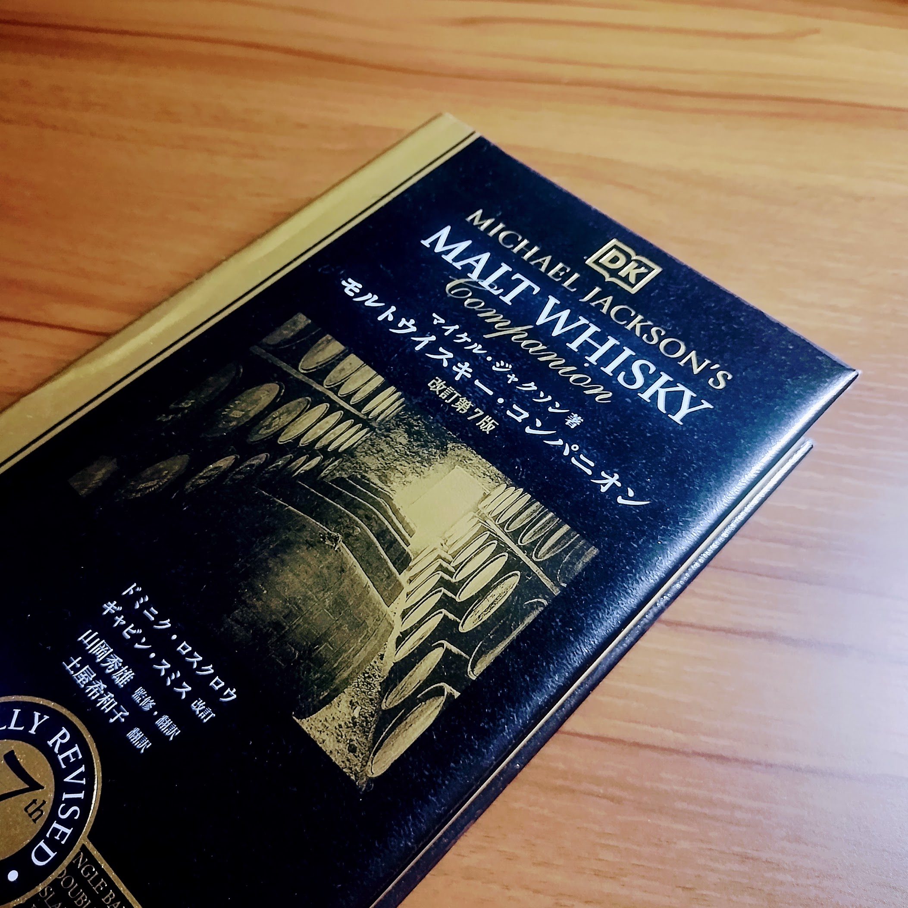

+++
title = "『モルトウイスキー・コンパニオン』第7版を読んだ"
date = 2026-06-25

[taxonomies]
tags = ["book", "whisky"]

[extra]
lang = "ja"
heading_hashes = true
+++

最近の趣味の一つにウイスキーがある。図書館でたまたま手に取ったので借りて読んでみた。

<!-- more -->

## どんな本か

モルトウイスキーについての本。

ウイスキーに関する歴史や用語、製法や地域性などについての解説から始まる。本全体の実に8割にあたるページは実際のボトルとそのテイスティングノートを記すのに割かれており、ウイスキーカタログ的な様相を呈している。

この本は1989年にイギリスで出版され、その後も改訂を重ねボトリングのラインナップを更新し続けて今日に至るようだ。今回読んだのは第7版の邦訳版で、原版では2015年、邦訳版は2021年に出版された。2026年6月現在における英語原書の最新改訂版は2022年に出た第8版であるが、邦訳版はない。
今回手に取った第7版は2015年の情報なので当たり前だが、ボトルのラインナップは最新とは言い難い。でもむしろ当時入手できたラインナップのスナップショットといったかんじで見ていて面白い。

## 著者について
著者であるマイケル・ジャクソン氏についても少し調べた。彼は酒類についての著作で有名な評論家でありジャーナリストだそうだ。2007年に65歳で亡くなっている。

彼は特にビール評論の第一人者として知られているらしく、1977年に著した『The World Guide to Beer』ではビールを多様なスタイルに分類して紹介し、クラフトビールの興隆に影響を与えたとされる。ガーディアン紙による訃報では次のように書かれている。

>彼はビールをエールやラガーといった狭い概念から解き放ち、その地位を確立する先駆者となった。

元は記者をやっていてビールについて書いたものを寄稿して有名になり、ウイスキーにも足を伸ばしていったようだ。1987年刊行の『The World Guide to Whisky』ではウイスキーを産地・製法・文化から論じる評論を示し、1989年にはこの本の原書である『Malt Whisky Companion』の初版を刊行した。

## 原著者亡きあとの改訂

既に述べたが、原著者であるマイケル・ジャクソン氏は2007年に亡くなっている。彼が携わった最後の版は 2004年の第5版までであり、その後はウイスキー等を扱うジャーナリストであるドミニク・ロスクロウ氏やギャビン・D・スミス氏らによる改訂がなされている。6,7,8版は彼らによる更新を含んでいる。

## 感想
最初のほうのウイスキーの解説がよかった。
普段はウイスキーを飲んだり、ボトルを買ったり、蒸留所に行ったりしているわけだが、そういう散発的な接触ではなかなか体系的な知識は入ってこない。
モルトがそもそも何かからはじまり、ウイスキーの起源、製法、地域性といった情報がこの本によっていい感じに整理されて良かった。

蒸留所の解説があるのが地味に嬉しくて、各所の歴史がまとまっているのは貴重だと思う。スコットランドに至っては地図付きで解説がある。
各ボトルのノートについては参考程度にしか見ていないが、ぱらぱら眺めるのは楽しかった。

以下その他トピックについて簡単に感想：

### 世界

当たり前だがバーボン樽はバーボンを作っている場所にしかないし、シェリー樽はシェリー酒を作っている場所にしかない。スコッチといえど熟成に使う樽は輸入せざるを得ないわけで、モルトとかは地のものを使うにしても、思っていたより世界各地との関わりを持ちながら製造されているんだなとか思ったりした。

白州とかもモルト輸入してるって言ってた気がするし、テロワール云々とは言いつつも各地との関わりは切っても切れないんだろうな。（白州・山崎はスコッチをリスペクトしているのも関係あるだろうが）

### サントリー強い

世界各地に様々な蒸留所がありその名を冠したシングルモルトが出ているが、販売等まで自前でやっているところはほとんどなく、大抵はいくつかの大きな飲料会社の傘下にある。

その一つがサントリーであり、現在の Suntory Global Spirits はボウモア・ラフロイグ・アードモア・グレンギリー・オーヘントッシャンといったスコットランドの蒸留所のほか、メーカーズマークやジムビームといったバーボンの蒸留所も所有している。

これはさすがのネットワークというか、そりゃサントリーはウイスキー強いわと思った。

### ブレンデッドウイスキーブランドの出自

あと面白かったのは現在のブレンデッドウイスキー系ブランドの出自。バランタインとかがいちばん身近だが、これ系のブランドは特定の蒸留所をアイデンティティにしておらず、ブレンデッドしか出していないという特徴がある。今日の高級ウイスキーはもっぱらシングルモルトだからこれらの立ち位置を不思議に思っていたんだけど、その起源は意外と古く、1800年代ごろにまで遡ることができるらしい。

当時のスコットランドの農家は副業としてウイスキーの蒸留をしていて、ウイスキーの入った樽を資産として持っていたそうだ。彼らにはボトリングの設備もなく一般の酒販売の認可もないため、樽ごと裕福な家やホテル、食料雑貨商などに売却していた。
農家のウイスキーはその品質も特徴も供給量も安定しないため、酒販売の認可を持つ食料雑貨商は自分たちでそれらを混ぜてボトリングし、オリジナルのラベルを貼って売っていた。ジョニーウォーカー、シーバスリーガル、バランタイン等はこのときのボトラーに端を発しているそうだ。だからブレンデッドしかないのかと納得するのと同時に、そんなに歴史があるんだという驚きがあった。

---

第8版のラインナップに興味が湧いてきた。原書のほう買おうかな。

ウイスキー楽しいね。
