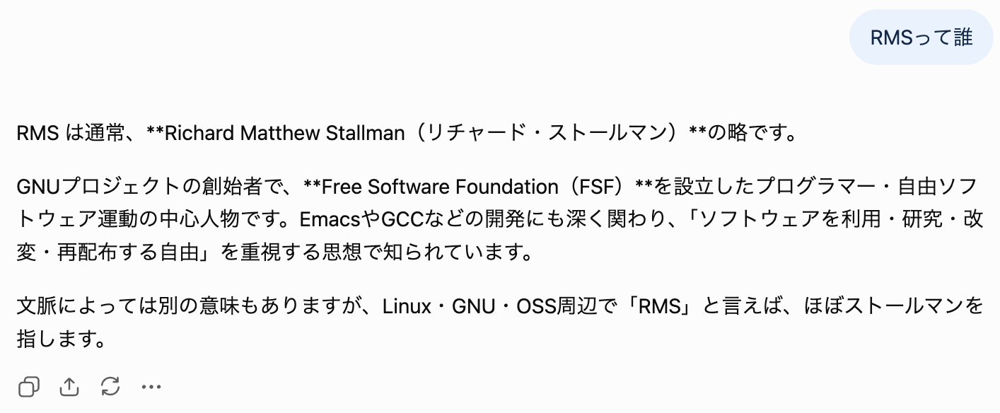

+++
title = "Markdownで**「強調に失敗する」**パターンを検出するtextlintルールを作った"
date = 2026-09-14

[taxonomies]
tags = ["textlint", "markdown"]

[extra]
lang = "ja"
heading_hashes = true
+++

## はじめに

LLM に Markdown を出力させると、強調になり損なった `*`（アスタリスク）がしばしば出現する。具体的にはこういうやつ：




画像の例では、強調を意図した文字列 `Richard Matthew Stallman（リチャード・ストールマン）` と `Free Software Foundation（FSF）` が太字にならず、その前後の装飾マーカーである `**` が見えてしまっている。

単なるチャットでこういう現象が起こるのは仕方ないにしても、AIエージェントとのやりとりとかではエージェントが勝手に気づいて勝手に直していてほしい。

## 作ったもの

ということでこちらを作った：

- [@lemonadern/textlint-rule-no-broken-cjk-emphasis - npm](https://www.npmjs.com/package/@lemonadern/textlint-rule-no-broken-cjk-emphasis)

自然言語向け Linter であるところの [textlint](https://textlint.org/) のルールで、Markdown 中の `*`（アスタリスク）のうち「強調に使われていそうなのに強調に失敗している」パターンを検出する。

リポジトリはこちら：[GitHub - lemonadern/textlint-rule-no-broken-cjk-emphasis](https://github.com/lemonadern/textlint-rule-no-broken-cjk-emphasis)

## つかいかた

インストールして、

```sh
npm install --save-dev textlint @lemonadern/textlint-rule-no-broken-cjk-emphasis
```

`.textlintrc` で有効にする

```json
{
  "rules": {
    "@lemonadern/no-broken-cjk-emphasis": true
  }
}
```

たとえば `example.md` に次のような文章があるとき、

```md
私は**「あれ」**と言った。

Richard Matthew Stallman（リチャード・ストールマン）は**Free Software Foundation（FSF）**を設立した。
```

次のコマンドで実行すると、

```sh
npx textlint example.md
```

このような警告が出る：

```
  1:3   error  `**` の直後が約物または記号のため、強調の開始として解釈されません。約物または記号を強調範囲の外に出すか、`**` の直前に空白を入れてください。  @lemonadern/no-broken-cjk-emphasis
  1:9   error  `**` の直前が約物または記号のため、強調の終了として解釈されません。約物または記号を強調範囲の外に出すか、`**` の直後に空白を入れてください。  @lemonadern/no-broken-cjk-emphasis
  3:71  error  `**` の直前が約物または記号のため、強調の終了として解釈されません。約物または記号を強調範囲の外に出すか、`**` の直後に空白を入れてください。  @lemonadern/no-broken-cjk-emphasis

✖ 3 problems (3 errors, 0 warnings, 0 infos)
```

直し方は複数あって、適当な方法を選べる。

1. `**` の外側（約物と反対側）に空白を入れる：`**Free Software Foundation（FSF）** を設立した`
2. 約物を強調範囲の外に出す：`**Free Software Foundation（FSF**）を設立した`

2 で示している例だと後ろの括弧だけが強調から外れており拒否反応を呼びそうな修正になっている。
文脈によって適切な（マシな）直し方を一意に決定できないため自動修正は提供していない。

## しくみ

### 強調に失敗する原因

問題の現象は主に CommonMark の仕様と CJK における文章との噛み合わせによって発生している。

[CommonMark における強調構文の仕様](https://spec.commonmark.org/0.31.2/#emphasis-and-strong-emphasis) には強調マーカーと約物（記号）が隣接するケースについての規定があるが、この仕様は分かち書きされた文章を暗黙の前提としている。しかし日本語や中国語では単語間に空白を入れないため、約物が絡むケースで強調構文の規則を自然に満たせない場合がある。そういったケースではアスタリスクが強調のマーカーとして解釈されずに通常のテキストとして出てきてしまうという仕組みらしい。

パーサのバグとかではないので、根本的にこの問題を解決するには仕様を修正する必要がある。
以前から仕様改善の議論自体はあるものの、どうやら採用には至っていない。そのため CommonMark 準拠のパーサではこの問題が発生してしまうというわけだ。

- [Emphasis with CJK punctuation · commonmark/commonmark-spec #650](https://github.com/commonmark/commonmark-spec/issues/650)
- [Emphasis and East Asian text - CommonMark Discussion](https://talk.commonmark.org/t/emphasis-and-east-asian-text/2491)

### 対処法

この問題への（仕様改善以外での）対処法は2つある。

1. 強調として解釈されるように空白等を適宜入れて調整する
2. CJK friendly なパーサ（あるいはプラグイン）を使う

本稿で紹介している textlint ルールは前者（1）での対処をアシストするものである。レンダリング失敗を防ぐために空白を入れたり約物の位置を変えたりする類の調整を入れるべき箇所を示す。この対処法は最も簡単だが、挿入した空白がレンダリング結果に残るため、それが不自然に感じられて許容できないというケースはありそうだ。

そして、後者（2）の方法は CJK friendly なパーサを使うというものである。パーサが自分の制御下にあって CommonMark にこだわる理由がないときはこちらを採用するとよさそう。

たとえば [Comrak](https://github.com/kivikakk/comrak) では CJK friendly emphasis 拡張を有効にするとこの挙動になる。ほかにも主要なパーサで使えるプラグインだと [tats-u/markdown-cjk-friendly](https://github.com/tats-u/markdown-cjk-friendly) 等がある。

言わずもがなだが、 CJK friendly なパーサを利用している環境では今回紹介している textlint ルールを使う必要はない。


### 検出メカニズム

[@lemonadern/textlint-rule-no-broken-cjk-emphasis](https://www.npmjs.com/package/@lemonadern/textlint-rule-no-broken-cjk-emphasis) は textlint ルールとして作成していて、Markdown をパースした木を対象に検出をする。

木のうち通常のテキストにあたるノードに `*` があれば、約物との隣接や開閉対応を調べて怪しいパターンを報告する感じになっている。強調の開始と終了の条件は CommonMark と同じ条件で判定するが、強調マーカーの対応付けを完全に再現しているわけではないので、あくまで疑わしいパターンを検出するヒューリスティックである。

## おわりに

作ったはいいものの、自分が textlint を整備しているような環境では強調をあまり使わないので出番を大して用意できていない。気になる人がいたら使ってみてほしい。

## 参考

- [なぜ強調表示できず \*\* が表示されるのか — Perlで始まったMarkdownの歴史と日本語文書における課題 - Speaker Deck](https://speakerdeck.com/kwahiro/nazeqiang-diao-biao-shi-dekizu-star-star-gabiao-shi-sarerunoka-perldeshi-matutamarkdownnoli-shi-tori-ben-yu-wen-shu-niokeruke-ti)
  - 問題の原因と歴史的経緯について解説した資料。わかりやすい
- [Markdown で日本語のテキストの括弧囲みを強調するのが難しい件](https://gist.github.com/MurakamiShinyu/da24dbd6c1c2342331aa9dda23de477f)
  - 同様の問題についてまとめている Gist
- [cmark-cjk-lint.rb](https://gist.github.com/ssig33/62bdcb313c92a12fbb01335e69f18b4c)
  - 本ツールと同じモチベーションのスクリプト。こちらは正規表現ベースでより簡易的な実装をしている
